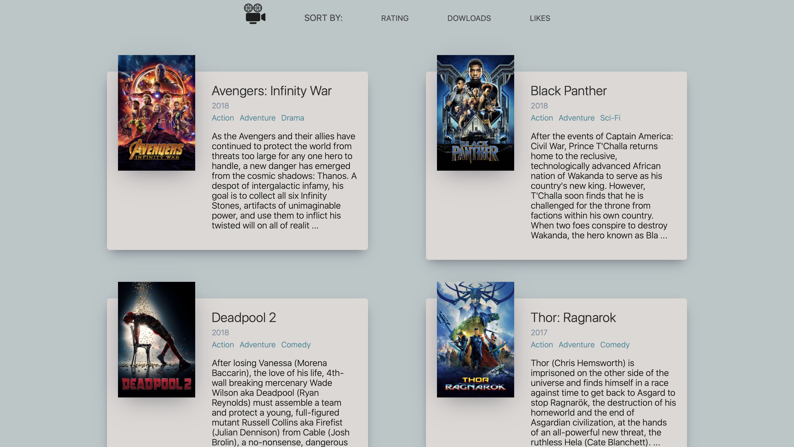
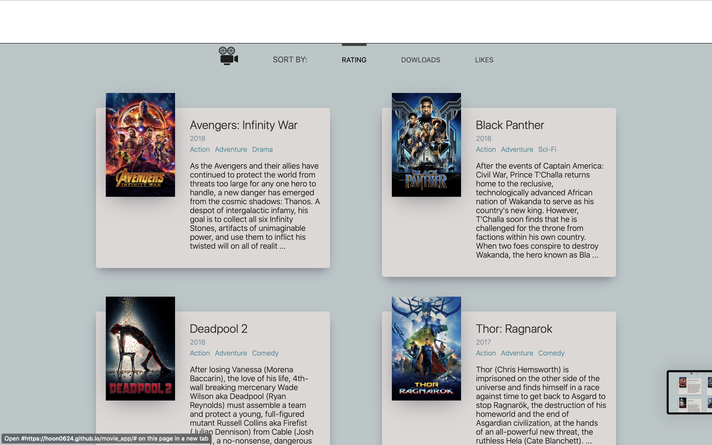

# Movie App 2020 
* App deployed on https://hoon0624.github.io/movie_app/

* A web app that displays movie posters, genres, and summaries. 

* API used: https://yts.mx/api#list_movies

* NavBar 

## Deploying on github server
----
* Follow directions in this [link](https://create-react-app.dev/docs/deployment/#github-pages-https-pagesgithubcom).
* add `"predeploy": "npm run build"` in package.json file under `scripts`

## Next Step
----
* Make it more interactive. 