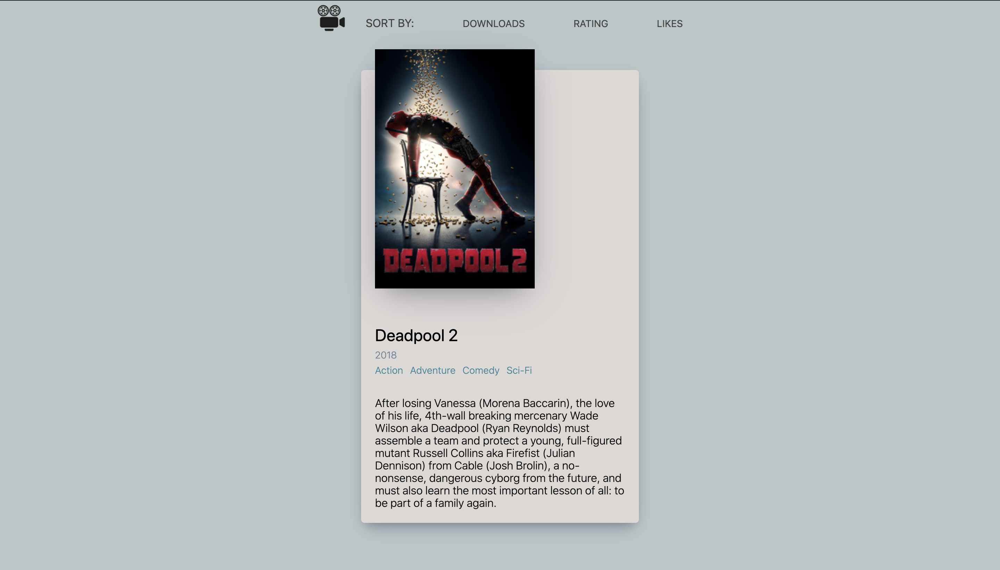
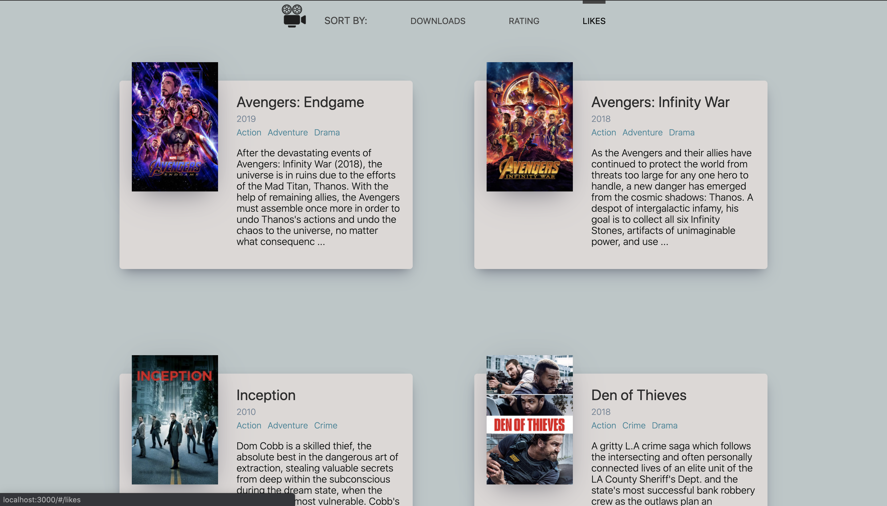
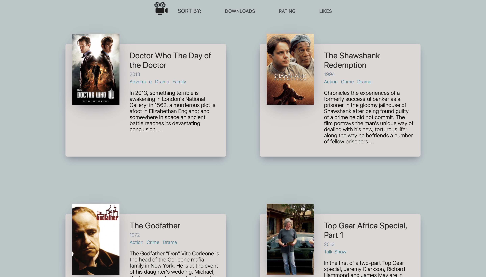

# Movie App 2020 
* App deployed on https://hoon0624.github.io/movie_app/

* A web app that displays movie posters, genres, and summaries. 

* API used: https://yts.mx/api#list_movies

* NavBar 

* Click on individual movie to view more information

* Different movie lists by rating, download count, and like count. 

## Deploying on github server
----
* Follow directions in this [link](https://create-react-app.dev/docs/deployment/#github-pages-https-pagesgithubcom).
* Add `"predeploy": "npm run build"` in package.json file under `scripts`.
* After pushing changes to git, deploy it by `npm run deploy` command.

## Next Step
----
* Make it more interactive. 

## Update 
____ 

* Now fully interactive web app.
* Can click on individual movie to see more information. 
* Also can list movies by ratings, downloads count, and likes count.